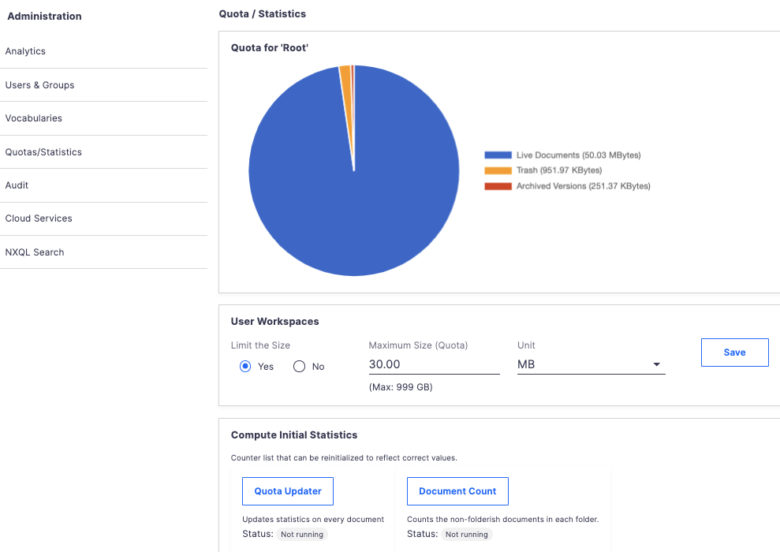
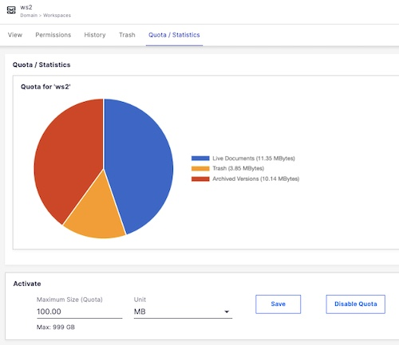

# nuxeo-quota-webui


## Features

This plugin brings Web UI to [nuxeo-quota](https://doc.nuxeo.com/nxdoc/nuxeo-quota/). The nuxeo-quota plugin UI is deprecated (depending on JSF). This plugin takes what was done in JSF (via SEAM beans) and converted them to WebUI + java operations.

Basically:

* Move the deprecated JSF code found at `countQuotaStatsActions.java` (nuxeo-jsf-ui-lts/code/nuxeo-quota-web/src/main/java/org/nuxeo/ecm/quota/countQuotaStatsActions.java) to some operations (to get/set quota on User Workspaces, etc.)
* Add the different polymer elements required by the UI.

See below "Possible `TODO`".

> [!IMPORTANT]
> This plugin is available on the marketplace in its latest release, and can be installed as any plugin (`nuxeoctl mp-install nuxeo-quota-webui`)

## Usage

#### "Quota / Statistics" Admin panel

* Display pie-chart stats
* Activate User Workspaces quota, setting the max size for every User Workspace.
  * The max possible value is by default 999 GB
* Run counters for the first time, on existing (and current) repository.

The work is done asynchronously, since it can take time depending on the number of users and the volume of content in each User Workspace.



#### New Tab at Container Level


By default, the tab is displayed for `Domain` and `Workspace`. This can be tuned by setting the `nuxeo.quota.containersfilter` configuration parameter in `nuxeo.conf`. It is a comma-separated list, which is directly used in a `nuxeo-filter` element in WebUI. For example:

```
nuxeo.quota.containersfilter=Domain,Workspace,MyCustomContainer
```

When available for document, it displays "Quota / Statistics" tab with:

* A pie-chart of usage
* If user is Administrator or has the `Everything` permission (like in the deprecated version), then the quota can be set or unset.




## Known Issue(s)

Sometime, the localization file is not deploy. It is located at `nuxeo-quota-webui/nuxeo-quota-webui-ui/src/main/resources/web/nuxeo.war/ui/i18n`.

If you don't see the labels, then the work around is the following:

1. Copy the values found in the messages.json file.
  * Do not copy the beginning/ending `{` and `}`
2. Typically, paste the values in your Studio project > Modeler > UI > Translations > messages.json.
  * ⚠️ Make sure you paste with no JSON syntax error (don't forget the `,` after the last line after pasting, for example)
3. Deploy your Studio project


## Possible `TODO`

The work done works well, converting the deprecated JST actions to Automation operations called by the UI is a valid pattern.

At platform level, a [Pull request](https://doc.nuxeo.com/nxdoc/contributing-to-nuxeo/) contributing Nuxeo source code could be made, adding all this to the `nuxeo-quota` core code that is available in the platform (listeners that check the quotas, activation/de-activation of quotas, etc.). So, things that could be done:

* Move the java code of this plugins (operations, etc.) to the nuxeo-quota module
* Tune the UI, make it look, maybe, a bit better.


## Build and Install

  ```
  cd /path/to/nuxeo-quota-webui
  mvn clean install
  ```


## Licensing

[Apache License, Version 2.0](http://www.apache.org/licenses/LICENSE-2.0)


## Support
These features are not part of the Nuxeo Production platform.

These solutions are provided for inspiration and we encourage customers to use them as code samples and learning resources.

This is a moving project (no API maintenance, no deprecation process, etc.) If any of these solutions are found to be useful for the Nuxeo Platform in general, they will be integrated directly into platform, not maintained here.


## About Nuxeo
Nuxeo Platform is an open source Content Services platform, written in Java and provided by Hyland. Data can be stored in both SQL & NoSQL databases.

The development of the Nuxeo Platform is mostly done by Nuxeo employees with an open development model.

The source code, documentation, roadmap, issue tracker, testing, benchmarks are all public.

Typically, Nuxeo users build different types of information management solutions for [document management](https://www.nuxeo.com/solutions/document-management/), [case management](https://www.nuxeo.com/solutions/case-management/), and [digital asset management](https://www.nuxeo.com/solutions/dam-digital-asset-management/), use cases. It uses schema-flexible metadata & content models that allows content to be repurposed to fulfill future use cases.

More information is available at [www.hyland.copm](https://www.hyland.com).
