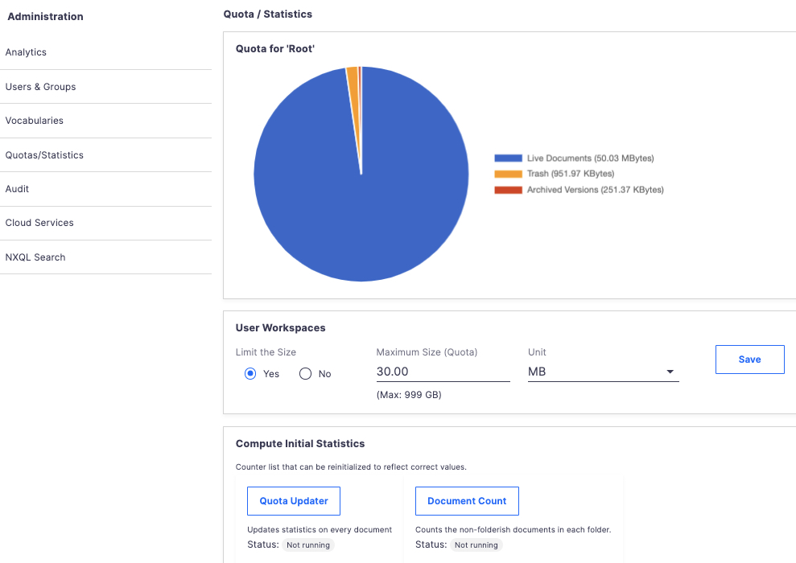
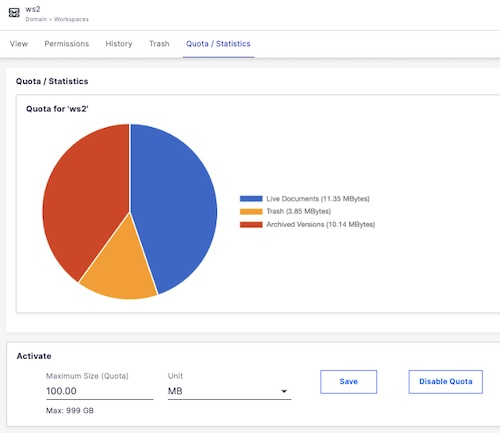

# nuxeo-quota-webui

> [!CAUTION]
> Version 2025.1.0-SNAPSHOT (for Nuxeo LTS 2025), in the `master` branch, is work in progress, still under developpment, and using GitHub as backup: **do not use it until it is released and available on Nuxeo Marketplace**.
> 
> Only the released version 1.1 (for Nuxeo LTS 2023) has been tested by a Nuxeo Presales.


## Features

This plugin brings Web UI to [nuxeo-quota](https://doc.nuxeo.com/nxdoc/nuxeo-quota/). The nuxeo-quota plugin UI is deprecated (depending on JSF). This plugin takes what was done in JSF (via SEAM beans) and converts them to WebUI + java operations.

Basically:

* Move the deprecated JSF code found at `countQuotaStatsActions.java` (nuxeo-jsf-ui-lts/code/nuxeo-quota-web/src/main/java/org/nuxeo/ecm/quota/countQuotaStatsActions.java) to some operations (to get/set quota on User Workspaces, etc.)
* Add the different polymer elements required by the UI.

**Parity with the legacy JSF plugin:**
* "Quotas / Statistics" Admin Center page (pie-chart stats, User Workspace quota activation, initial computation)
* "Quota / Statistics" tab on containers (`Domain`, `Workspace`, configurable)

**New features (not available in the legacy JSF `nuxeo-quota` plugin):**
* Per-user **total quota** (sum of bytes owned via `dc:creator`)
* Per-user **per-blob upload size cap**
* (Configurable with XML contribution, and can be modified by an administrator in the UI)

## Usage

#### "Quota / Statistics" Admin panel

* Display pie-chart stats
* Activate User Workspaces quota, setting the max size for every User Workspace.
  * The max possible value is by default 999 GB
* Run counters for the first time, on existing (and current) repository.

The work is done asynchronously, since it can take time depending on the number of users and the volume of content in each User Workspace.



#### New Tab at Container Level


By default, the tab is displayed for `Domain` and `Workspace`. This can be tuned by setting the `nuxeo.quota.containersfilter` configuration parameter in `nuxeo.conf`. It is a comma-separated list, which is directly used in a `nuxeo-filter` element in WebUI. For example:

```
nuxeo.quota.containersfilter=Domain,Workspace,MyCustomContainer
```

When available for document, it displays "Quota / Statistics" tab with:

* A pie-chart of usage
* If user is Administrator or has the `Everything` permission (like in the deprecated version), then the quota can be set or unset.




#### Per-user Upload Size and Per-user Quota

> [!NOTE]
> These per-user features did **not** exist in the legacy JSF `nuxeo-quota` plugin. They are added by this plugin and live alongside the original container-level quota.

Two enforcement mechanisms:

- **Per-blob upload size cap** — each individual file (blob) is checked against the user's effective `maxUploadSize`.
- **Per-user total quota** — the sum of all blob bytes owned by a user (keyed by `dc:creator`) is checked against the user's effective `maxTotalQuota`.

**Owner attribution gotcha.** Bytes are always counted against `dc:creator` of the document — never the editor. Because Nuxeo resets `dc:creator` on copy, copying a document counts those bytes against the user who performed the copy, not the original creator.

##### XML defaults

Configured via the `userQuotas` extension point on `nuxeo.quota.webui.user.UserQuotaService`:

```xml
<userQuota group="*" maxUploadSize="-1" maxTotalQuota="-1"/>
<userQuota group="members" maxUploadSize="50 MB" maxTotalQuota="2 GB"/>
```

##### Resolution order

For each limit key (`maxUploadSize`, `maxTotalQuota`):

1. User override (if any)
2. Group overrides for the user's groups — **max-wins**
3. XML group defaults for the user's groups — **max-wins**
4. XML `*` default
5. Unlimited

Administrators bypass enforcement. `-1` means **unlimited** (explicitly different from "no override / fall through").

##### Admin Center — "User Quotas" card

The "Quotas / Statistics" admin page has a new **User Quotas** card where administrators can:
* View the resolved XML defaults
* Add / edit / remove **group overrides**
* Add / edit / remove **user overrides**

Changes take effect immediately (no restart, no redeploy).


##### End-user "My quota usage" in the user menu

A new entry is contributed to the user menu (`USER_MENU_ITEMS` slot) showing the current user their own used bytes, effective limit, and percentage. Users without a configured limit see an "unlimited" message.


##### Initial computation & recompute

For an existing repository, launch computation from the Admin Center → **Compute Initial Statistics** → **Per-user quota**. It runs asynchronously via the Bulk Action Framework (stream-based, fault-tolerant) and populates the per-user counters.

Two additional Automation operations allow fine-grained recompute without going through the **Compute Initial Statistics** button. They are also surfaced in the Admin Center → **Quota / Statistics** → **User Quotas** card (under "Recompute per-user counters"): a comma-separated user IDs field with a **Recompute selected users** button, and a **Recompute all users** button.

| Operation ID | Purpose |
|---|---|
| `Quota.User.RecomputeUsers` | Recompute counters for specific user(s) only (admin) |
| `Quota.User.RecomputeAll` | Recompute counters for **all** users in the repository (admin) |

Both return a JSON blob with `{status, commandId, ...}`. The status is `"submitted"` on success or `"skipped"` when no valid users were provided.

Example — recompute for two users:
```bash
curl -u Administrator:Administrator -X POST \
  http://localhost:8080/nuxeo/automation/Quota.User.RecomputeUsers \
  -H 'Content-Type: application/json' \
  -d '{"params":{"users":["jdoe","asmith"]}}'
```


##### Completion event: `userQuotaRecomputeDone`

After each per-user quota recompute completes, the plugin fires a synchronous Nuxeo event named `userQuotaRecomputeDone` (constant `UserQuotaService.EVENT_USER_QUOTA_RECOMPUTE_DONE`). This lets external code refresh caches, notify users, kick off reporting, etc.

The event is fired from **all three** recompute entry points:

| Entry point | `scope` value |
|---|---|
| Admin Center → "Compute Initial Statistics" → "Per-user quota" (op `Quota.LaunchInitialComputation`) | `"all"` |
| `Quota.User.RecomputeAll` | `"all"` |
| `Quota.User.RecomputeUsers` | `"users"` |

Payload (all keys are `Serializable`):

| Key | Type | Description |
|---|---|---|
| `repositoryName` | String | Repository the command ran on |
| `scope` | String | `"all"` or `"users"` |
| `commandId` | String | BAF command identifier |
| `requestedUsers` | List\<String\> | Users that were requested (empty when `scope="all"`) |
| `processedUsers` | List\<String\> | Users that were actually processed (when `scope="all"`, populated post-completion by scanning the `quota-user-counters` KV store) |
| `skippedUsers` | List\<String\> | Unknown users that were skipped (always empty when `scope="all"`) |
| `userTotals` | Map\<String,Long\> | Final per-user byte totals. **Only users with `> 0` bytes are included.** |

Registering a listener:

```xml
<extension target="org.nuxeo.ecm.core.event.EventServiceComponent" point="listener">
  <listener name="myUserQuotaRecomputeListener"
            class="com.example.MyListener"
            async="false"
            postCommit="false">
    <event>userQuotaRecomputeDone</event>
  </listener>
</extension>
```

Caveats:

- Delivery is **synchronous** (fired from the completion `Work` thread, category `quota`). Keep listeners lightweight and never throw.
- The completion `Work` (`UserQuotaRecomputeCompletionWork`) waits up to **24 hours** for the BAF command. If it times out, the event is **not** fired and a `WARN` is logged.
- The Work blocks one thread of the `quota` work queue for the duration of the recompute. If you frequently launch parallel recomputes, increase the `quota` queue size.

##### Bulk import / migration — disabling enforcement

For a large bulk import or migration, the per-user quota listener can add measurable overhead per document write. Disable it for the duration of the import, then recompute the affected users' counters.

**Option 1 — Global disable via configuration (recommended for mass imports):**

```ini
# nuxeo.conf
nuxeo.quota.user.disabled=true
```

Requires `nuxeoctl restart`. When set, the listener performs no work (no enforcement, no counter updates).

Recipe:

1. Set `nuxeo.quota.user.disabled=true` in `nuxeo.conf` → `nuxeoctl restart`.
2. Run the mass import (note which user(s) are recorded as `dc:creator`).
3. Remove the property (or set to `false`) → `nuxeoctl restart`.
4. Run `Quota.User.RecomputeUsers` with the importer user list, or `Quota.User.RecomputeAll` for a full repository recompute.

**Option 2 — Programmatic from plugin code:**

```java
var svc = Framework.getService(UserQuotaService.class);
svc.setEnabled(false);
try {
    // ... bulk operation ...
} finally {
    svc.setEnabled(true);
}
```

Per-node, transient, lost on restart. Use for short programmatic operations.

**Option 3 — Per-document bypass:**

Reuses the platform's container-quota context-data flag, so existing code that disables container quota also disables per-user quota:

```java
doc.putContextData(AbstractQuotaStatsUpdater.DISABLE_QUOTA_CHECK_LISTENER, Boolean.TRUE);
session.saveDocument(doc);
```

##### Storage

Counters and overrides are persisted in `KeyValueService` named stores:

| Store | Purpose |
|---|---|
| `quota-user-counters` | Per-user current byte total |
| `quota-group-overrides` | Per-group live overrides |
| `quota-user-overrides` | Per-user live overrides |

In production these are automatically backed by the configured `default` key/value store (MongoDB or SQL) and are therefore **cluster-shared** with no extra configuration.

##### Automation operations (`Quota.User.*`)

You should not need to use these operations, they are listed here FYI.

| Operation ID | Purpose |
|---|---|---|
| `Quota.User.GetConfiguration` | Read XML defaults + all group/user overrides (admin) |
| `Quota.User.GetForCurrentUser` | Resolved limits + current usage for the caller |
| `Quota.User.GetForUser` | Resolved limits + usage for any user (admin) |
| `Quota.User.SetGroupOverride` | Create/update a group-level override (admin) |
| `Quota.User.ClearGroupOverride` | Remove a group-level override (admin) |
| `Quota.User.SetUserOverride` | Create/update a user-level override (admin) |
| `Quota.User.ClearUserOverride` | Remove a user-level override (admin) |
| `Quota.User.RecomputeUsers` | Recompute counters for specific user(s) — BAF (admin) |
| `Quota.User.RecomputeAll` | Recompute counters for all users — BAF (admin) |

##### Operation Security

All quota-modifying operations require administrator privileges:

| Operation | Protection |
|---|---|
| `Quota.SetOnUserWorkspaces` | Java-level admin check |
| `Quota.LaunchInitialComputation` | Java-level admin check |
| `Quota.User.GetConfiguration` | Java-level admin check |
| `Quota.User.*` (Set/Clear overrides, GetForUser, Recompute) | Java-level admin check |
| `Quotas.SetMaxSize` (platform) | REST binding (admin-only) |

The Java-level check is centralized in `nuxeo.quota.webui.QuotaUtils.ensureAdmin(CoreSession)`. A user passes the check when **any** of the following is true:

1. The principal is a Nuxeo administrator (`NuxeoPrincipal.isAdministrator()`).
2. The principal's user ID is listed in the `nuxeo.quota.webui.admin.users` property.
3. The principal is a member of any group listed in the `nuxeo.quota.webui.admin.groups` property.

**Configuring Quota Administrators (`nuxeo.conf`)**

```properties
# Groups whose members can manage quotas (comma-separated). Default: administrators
nuxeo.quota.webui.admin.groups=administrators,quota-managers

# Specific user IDs allowed to manage quotas (comma-separated). Default: (empty)
nuxeo.quota.webui.admin.users=jdoe,asmith
```

Both properties are read live (no restart needed after `nuxeoctl restart` once `nuxeo.conf` is changed; properties are not cached). To allow only Nuxeo administrators, leave both unset or set `nuxeo.quota.webui.admin.groups=administrators`.

The UI honors the same resolution via the helper operation `Quota.CanManageQuotas`, which returns `{ "canManage": true|false }` for the current user. The document tab uses this to decide whether to render edit controls; the server always re-validates.

**Customizing `Quotas.SetMaxSize` Access**

The platform operation `Quotas.SetMaxSize` (used to set container quotas) is restricted to administrators via a REST binding contributed by this plugin. Because the operation source is owned by the platform, `ensureAdmin()` cannot be added inside it, so the REST binding is the enforcement point and is independent of `nuxeo.quota.webui.admin.groups`. To allow additional groups to set container quotas, override the binding in your own XML contribution:

```xml
<require>nuxeo.quota.webui.automation.bindings</require>
<extension target="org.nuxeo.ecm.automation.server.AutomationServer" point="bindings">
  <binding name="Quotas.SetMaxSize">
    <administrator>true</administrator>
    <groups>powerusers,quota-managers</groups>
  </binding>
</extension>
```

See [Filtering Exposed Operations](https://doc.nuxeo.com/nxdoc/filtering-exposed-operations/) for more details.

## Known Issue(s)

#### Labels Display Translation Keys
Sometime, the localization file is not deployed. It is located at `nuxeo-quota-webui/nuxeo-quota-webui-ui/src/main/resources/web/nuxeo.war/ui/i18n`.

If you don't see the labels ("action.activate.quota" instead of "Activate" for example), then the work around is the following:

1. Copy the values found in the messages.json file.
  * Do not copy the beginning/ending `{` and `}`
2. Typically, paste the values in your Studio project > Modeler > UI > Translations > messages.json.
  * ⚠️ Make sure you paste with no JSON syntax error (don't forget the `,` after the last line after pasting, for example)
3. Deploy your Studio project


#### Error Handling
When a user uploads content that makes the container reach its quota — or that exceeds the per-user `maxTotalQuota` / `maxUploadSize` — the error displayed in the UI is not explicit. The creation dialog just displays that "an error occurred" (the error is explicit in `server.log`). We are missing some error bubbling and handling to make it clear to the end user that they reached a quota.


## Possible `TODO`

Converting the deprecated JSF actions to Automation operations called by the UI is a valid pattern that works well.

At platform level, a [Pull request](https://doc.nuxeo.com/nxdoc/contributing-to-nuxeo/) contributing Nuxeo source code could be made, adding all this to the `nuxeo-quota` core code that is available in the platform (listeners that check the quotas, activation/de-activation of quotas, etc.). So, things that could be done:

* Move the java code of this plugin (operations, etc.) to the nuxeo-quota module
* WebUI: Bubble the error when the quota is reached
* Tune the UI global look & feel, make it look, maybe, a bit better.


## Deploy / Build and Deploy

### Build and Deploy Locally

```bash
git clone https://github.com/nuxeo-sandbox/nuxeo-quota-webui
cd nuxeo-quota-webui
mvn clean install
```

To skip unit testing, add `-DskipTests`.

The Marketplace package is generated at:
```
nuxeo-quota-webui-package/target/nuxeo-quota-webui-package-{VERSION}}-*.zip
```

Install it via `nuxeoctl`:
```bash
nuxeoctl mp-install /path/to/nuxeo-quota-webui-package-{VERSION}.zip
```

### Deploy from Nuxeo Marketplace

This plugin is available as a package on the [Nuxeo Marketplace](https://connect.nuxeo.com/nuxeo/site/marketplace/package/nuxeo-quota-webui), you can just:

```bash
nuxeoctl mp-install nuxeo-quota-webui
```


## Support

**These features are not part of the Nuxeo Production platform.**

These solutions are provided for inspiration and we encourage customers to use them as code samples and learning resources.

This is a moving project (no API maintenance, no deprecation process, etc.) If any of these solutions are found to be useful for the Nuxeo Platform in general, they will be integrated directly into the platform, not maintained here.

## License

[Apache License, Version 2.0](http://www.apache.org/licenses/LICENSE-2.0.html)

## About Nuxeo

Nuxeo Platform is an open source highly scalable, cloud-native, enterprise content management product with rich multimedia support, written in Java. Data can be stored in both SQL & NoSQL databases.

The development of the Nuxeo Platform is mostly done by Nuxeo employees with an open development model.

The source code, documentation, roadmap, issue tracker, testing, benchmarks are all public.

More information is available at [Hyland/Nuxeo](https://www.hyland.com/en/solutions/products/nuxeo-platform).
